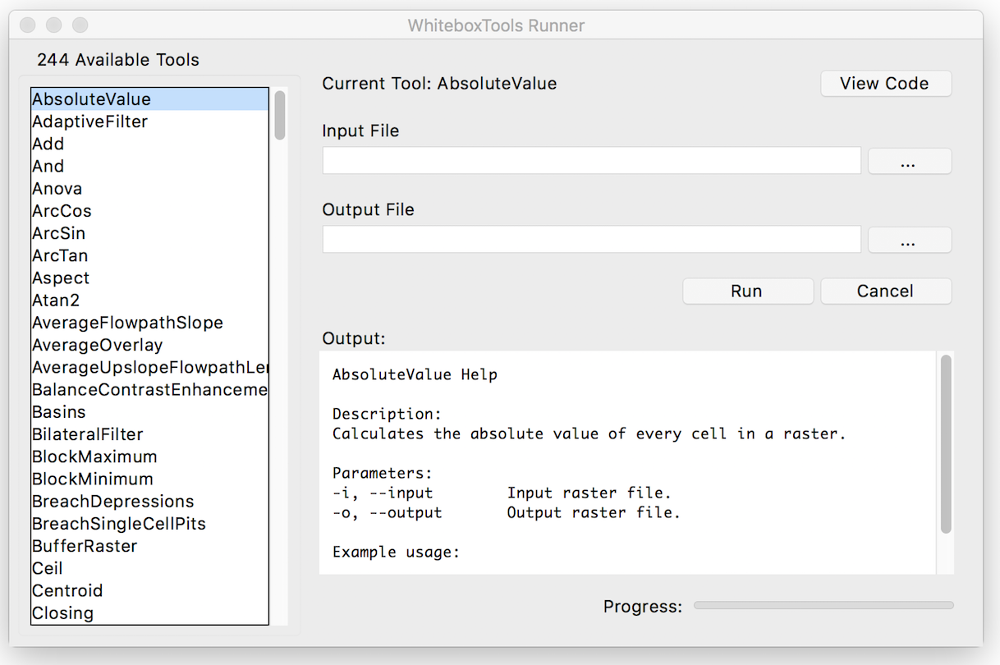

*Bringing the power of Whitebox GAT to the world at large*


*This page is related to the stand-alone command-line program and Python scripting API for geospatial analysis, **WhiteboxTools**. If you are instead interested in the open-source GIS, **Whitebox GAT**, please see this [link](https://github.com/jblindsay/whitebox-geospatial-analysis-tools).*

**Contents**

1. [Description](#1-description)
2. [Downloads and Installation](#2-downloads-and-installation)
3. [Usage](#3-usage)
4. [Available Tools](#4-available-tools)
5. [Supported Data Formats](#5-supported-data-formats)
6. [Contributing](#6-contributing)
7. [License](#7-license)
8. [Reporting Bugs](#8-reporting-bugs)
9. [Known Issues](#9-known-issues)
10. [Frequently Asked Questions](#10-frequently-asked-questions)
    * [Do I need Whitebox GAT to use WhiteboxTools?](#do-i-need-whitebox-gat-to-use-whiteboxtools)
    * [How do I request a tool be added?](#how-do-i-request-a-tool-be-added)
    * [Can WhiteboxTools be incorporated into other software and open-source GIS projects?](#can-whiteboxtools-be-incorporated-into-other-software-and-open-source-gis-projects)
    * [What platforms does WhiteboxTools support?](#what-platforms-does-whiteboxtools-support)
    * [What are the system requirements?](#what-are-the-system-requirements)
    * [Are pre-compiled executables of WhiteboxTools available?](#are-pre-compiled-executables-of-whiteboxtools-available)
    * [Why is WhiteboxTools Programmed in Rust?](#why-is-whiteboxtools-programmed-in-rust)
    * [Do I need Rust installed on my computer to run WhiteboxTools?](#do-i-need-rust-installed-on-my-computer-to-run-whiteboxtools)
    * [How does WhiteboxTools' design philosophy differ?](#how-does-whiteboxtools-design-philosophy-differ)
    
## 1 Description

**WhiteboxTools** is an advanced geospatial data analysis platform developed by Prof. John Lindsay ([webpage](http://www.uoguelph.ca/~hydrogeo/index.html); [jblindsay](https://github.com/jblindsay)) at the [University of Guelph's](http://www.uoguelph.ca) [*Geomorphometry and Hydrogeomatics Research Group*](http://www.uoguelph.ca/~hydrogeo/index.html). *WhiteboxTools* can be used to perform common geographical information systems (GIS) analysis operations, such as cost-distance analysis, distance buffering, and raster reclassification. Remote sensing and image processing tasks include image enhancement (e.g. panchromatic sharpening, contrast adjustments), image mosaicing, numerous filtering operations, simple classification (k-means), and common image transformations. *WhiteboxTools* also contains advanced tooling for spatial hydrological analysis (e.g. flow-accumulation, watershed delineation, stream network analysis, sink removal), terrain analysis (e.g. common terrain indices such as slope, curvatures, wetness index, hillshading; hypsometric analysis; multi-scale topographic position analysis), and LiDAR data processing. LiDAR point clouds can be interrogated (LidarInfo, LidarHistogram), segmented, tiled and joined, analyized for outliers, interpolated to rasters (DEMs, intensity images), and ground-points can be classified or filtered. *WhiteboxTools* is not a cartographic or spatial data visualization package; instead it is meant to serve as an analytical backend for other data visualization software, mainly GIS.

Although *WhiteboxTools* is intended to serve as a source of plugin tools for the [*Whitebox GAT*](http://www.uoguelph.ca/~hydrogeo/Whitebox/) open-source GIS project, the tools contained in the library are stand-alone and can run outside of the larger Whitebox GAT project. See [Usage](#usage) for further details. There have been a large number of requests to call *Whitebox GAT* tools and functionality from outside of the Whitebox user-interface (e.g. from Python automation scripts). *WhiteboxTools* is intended to meet these usage requirements. Eventually most of the approximately 400 tools contained within *Whitebox GAT* [will be ported](tool_porting.md) to *WhiteboxTools*. In addition to separating the processing capabilities and the user-interface (and thereby reducing the reliance on Java), this migration should significantly improve processing efficiency. This is because [Rust](https://www.rust-lang.org/en-US/), the programming language used to develop *WhiteboxTools*, is generally [faster than the equivalent Java code](http://benchmarksgame.alioth.debian.org/u64q/compare.php?lang=rust&lang2=java) and because many of the *WhiteboxTools* functions are designed to process data in parallel wherever possible. In contrast, the older Java codebase included largely single-threaded applications.

The *WhiteboxTools* project is related to the [*GoSpatial*](https://github.com/jblindsay/go-spatial) project, which has similar goals but is designed using the Go programming language instead of Rust. *WhiteboxTools* has however superseded
the *GoSpatial* project, having subsumed all of its functionality.

## 2 Downloads and Installation

*WhiteboxTools* is a stand-alone executable command-line program with no actual installation. If you intend to use the Python programming interface for *WhiteboxTools* you will need to have Python 3 (or higher) installed. Pre-compiled binaries can be downloaded from the [*Geomorphometry and Hydrogeomatics Research Group*](http://www.uoguelph.ca/~hydrogeo/software.shtml#WhiteboxTools) software web site for various supported operating systems. It is likely that *WhiteboxTools* will work on a wider variety of operating systems and architectures than the distributed binary files. If you do not find your operating system/architecture in the list of available *WhiteboxTool* binaries, then compilation from source code will be necessary. WhiteboxTools can be compiled from the source code with the following steps:

1. Install the Rust compiler; Rustup is recommended for this purpose. Further instruction can be found at this [link](https://www.rust-lang.org/en-US/install.html).

2. Download the Whitebox GAT [source code](https://github.com/jblindsay/whitebox-geospatial-analysis-tools). Note: WhiteboxTools is currently housed as a sub-repository of the main Whitebox GAT repo. To download the code, click the green Clone or download button on the GitHub repository site.

3. Decompress the zipped download file.

4. Open a terminal (command prompt) window and change the working directory to the whitebox_tools sub-folder, which is contained within the decompressed downloaded Whitebox GAT folder:

```
>> cd /path/to/folder/whitebox_tools/
```

5. Finally, use the rust package manager Cargo, which will be installed along with Rust, to compile the executable:

```
>> cargo build --release
```

Depending on your system, the compilation may take several minutes. When completed, the compiled binary executable file will be contained within the *whitebox_tools/target/release/ folder*. Type *./whitebox_tools --help* at the command prompt (after cd'ing to the containing folder) for information on how to run the executable from the terminal.

Be sure to follow the instructions for installing Rust carefully. In particular, if you are installing on MS Windows, you must have a linker installed prior to installing the Rust compiler (rustc). The Rust webpage recommends either the **MS Visual C++ 2015 Build Tools** or the GNU equivalent and offers details for each installation approach. You should also consider using **RustUp** to install the Rust compiler.

## 3 Usage

*WhiteboxTools* is a command-line program and can be run either by calling it, with appropriate commands and arguments, from a terminal application, or, more conveniently, by calling it from a script. The following commands are recognized by the *WhiteboxTools* library:

| Command           | Description                                                                                       |
| ----------------- | ------------------------------------------------------------------------------------------------- |
| --cd, --wd        | Changes the working directory; used in conjunction with --run flag.                               |
| -h, --help        | Prints help information.                                                                          |
| -l, --license     | Prints the whitebox-tools license.                                                                |
| --listtools       | Lists all available tools, with tool descriptions. Keywords may also be used, --listtools slope.  |
| -r, --run         | Runs a tool; used in conjunction with --cd flag; -r="LidarInfo".                                  |
| --toolbox         | Prints the toolbox associated with a tool; --toolbox=Slope.                                       |
| --toolhelp        | Prints the help associated with a tool; --toolhelp="LidarInfo".                                   |
| --toolparameters  | Prints the parameters (in json form) for a specific tool; --toolparameters=\"LidarInfo\".         |
| -v                | Verbose mode. Without this flag, tool outputs will not be printed.                                |
| --viewcode        | Opens the source code of a tool in a web browser; --viewcode=\"LidarInfo\".                       |
| --version         | Prints the version information.                                                                   |

Generally, the Unix convention is that single-letter arguments (options) use a single hyphen (e.g. -h) while word-arguments (longer, more descriptive argument names) use double hyphen (e.g. --help). The same rule is used for passing arguments to tools as well. Use the *--toolhelp* argument to print information about a specific tool (e.g. --toolhelp=Clump). Tool names can be specified either using the snake_case or CamelCase convention (e.g. *lidar_info* or *LidarInfo*).

For examples of how to call functions and run tools from *WhiteboxTools*, see the *whitebox_example.py* Python script, which itself uses the *whitebox_tools.py* script as an interface for interacting with the executable file.

In addition to direct command-line and script-based interaction, a very basic user-interface called *WB Runner* can be used to call the tools within the *WhiteboxTools* executable file, providing the required tool arguments.

**Example command prompt:**

```
>>./whitebox_tools --wd='/Users/johnlindsay/Documents/data/' --run=DevFromMeanElev 
--input='DEM clipped.dep' --output='DEV raster.dep' -v
```

Notice the quotation marks (single or double) used around directories and filenames, and string tool arguments in general. Use the '-v' flag (run in verbose mode) to force the tool print output to the command prompt. Please note that the whitebox_tools executable file must have permission to be executed; on some systems, this may require setting special permissions. The '>>' is shorthand for the command prompt and is not intended to be typed. Also, the above example uses the forward slash character (/), the directory path separator used on unix based systems. On Windows, users should use the back slash character (\\) instead.

**Example Python script:**

The following script relies on the imported functions contained within the whitebox_tools.py script, included within the *WhiteboxTools* distribution folder, and can be run using Python 3. **Please note that all of the scripts included with *WhiteboxTools* assumes the user system is configured with Python 3 and may not run as expected using Python 2**.

```Python
import os
import sys
from whitebox_tools import WhiteboxTools

wbt = WhiteboxTools()

# If the WhiteboxTools executable file (whitbox_tools.exe) is not in the same
# directory as this script, its path will need to be set, e.g.:
wbt.set_whitebox_dir(os.path.dirname(
    os.path.abspath(__file__)) + "/target/release/")  # or simply wbt.exe_path = ...

# Set the working directory. This is the path to the folder containing the data,
# i.e. files sent to tools as input/output parameters. You don't need to set
# the working directory if you specify full path names as tool parameters.
wbt.work_dir = os.path.dirname(os.path.abspath(__file__)) + "/testdata/"

# Sets verbose mode (True or False). Most tools will suppress output (e.g. updating
# progress) when verbose mode is False. The default is True
# wbt.set_verbose_mode(False) # or simply, wbt.verbose = False

# The most convenient way to run a tool is to use its associated method, e.g.:
wbt.elev_percentile("DEM.tif", "output.tif", 15, 15)
# You may also provide an optional custom callback for processing output from the
# tool. If you don't provide a callback, and verbose is set to True, tool output
# will simply be printed to the standard output.

# Prints the whitebox-tools help...a listing of available commands
print(wbt.help())

# Prints the whitebox-tools license
print(wbt.license())

# Prints the whitebox-tools version
print("Version information: {}".format(wbt.version()))

# List all available tools in whitebox-tools
print(wbt.list_tools())

# Lists tools with 'lidar' or 'LAS' in tool name or description.
print(wbt.list_tools(['lidar', 'LAS']))

# Print the help for a specific tool.
print(wbt.tool_help("ElevPercentile"))
# Notice that tool names within WhiteboxTools.exe are CamelCase but
# you can also use snake_case here, e.g. print(wbt.tool_help("elev_percentile"))

```

**WhiteboxTools Runner**

There is a Python script contained within the *WhiteboxTools* directory called '*wb_runner.py*'. This script is intended to provide a very basic user-interface for running the tools contained within the *WhiteboxTools* library. The user-interface uses Python's TkInter GUI library and is cross-platform. The user interface is currently experimental and is under heavy testing. Please report any issues that you experience in using it.



The *WhiteboxTools Runner* does not rely on the *Whitebox GAT* user interface at all and can therefore be used indepedent of the larger project. The script must be run from a directory that also contains the '*whitebox_tools.py*' Python script and the '*whitebox_tools*' executable file. There are plans to link tool help documentation in *WhiteboxTools Runner*.

## 4 Available Tools

Eventually most of *Whitebox GAT's* approximately 450 tools [will be ported](tool_porting.md) to *WhiteboxTools*, although this is an immense task. Support for vector data (Shapefile/GeoJSON) reading/writing and a topological analysis library (like the Java Topology Suite) will need to be added in order to port the tools involving vector spatial data. Opportunities to parallelize algorithms will be sought during porting. All new plugin tools will be added to *Whitebox GAT* using this library of functions. 

The library currently contains the following 314 tools, which are each grouped based on their main function into one of the following categories: Data Tools, GIS Analysis, Hydrological Analysis, Image Analysis, LiDAR Analysis, Mathematical and Statistical Analysis, Stream Network Analysis, and Terrain Analysis. The following is a complete listing of available tools, with brief tool descriptions.

**Data Tools**

- ***ConvertNodataToZero***: Converts nodata values in a raster to zero.
- ***ConvertRasterFormat***: Converts raster data from one format to another.
- ***ExportTableToCsv***: Exports an attribute table to a CSV text file.
- ***NewRasterFromBase***: Creates a new raster using a base image.
- ***PrintGeoTiffTags***: Prints the tags within a GeoTIFF.
- ***SetNodataValue***: Assign a specified value in an input image to the NoData value.
- ***VectorLinesToRaster***: Converts a vector containing polylines into a raster.
- ***VectorPointsToRaster***: Converts a vector containing points into a raster.
- ***VectorPolygonsToRaster***: Converts a vector containing polygons into a raster.

**Geomorphometric Analysis**

- ***Aspect***: Calculates an aspect raster from an input DEM.
- ***DevFromMeanElev***: Calculates deviation from mean elevation.
- ***DiffFromMeanElev***: Calculates difference from mean elevation (equivalent to a high-pass filter).
- ***DirectionalRelief***: Calculates relief for cells in an input DEM for a specified direction.
- ***DownslopeIndex***: Calculates the Hjerdt et al. (2004) downslope index.
- ***ElevAbovePit***: Calculate the elevation of each grid cell above the nearest downstream pit cell or grid edge cell.
- ***ElevPercentile***: Calculates the elevation percentile raster from a DEM.
- ***ElevRelativeToMinMax***: Calculates the elevation of a location relative to the minimum and maximum elevations in a DEM.
- ***ElevRelativeToWatershedMinMax***: Calculates the elevation of a location relative to the minimum and maximum elevations in a watershed.
- ***FeaturePreservingDenoise***: Reduces short-scale variation in an input DEM using a modified Sun et al. (2007) algorithm.
- ***FetchAnalysis***: Performs an analysis of fetch or upwind distance to an obstacle.
- ***FillMissingData***: Fills nodata holes in a DEM.
- ***FindRidges***: Identifies potential ridge and peak grid cells.
- ***Hillshade***: Calculates a hillshade raster from an input DEM.
- ***HypsometricAnalysis***: Calculates a hypsometric curve for one or more DEMs.
- ***MaxAnisotropyDev***: Calculates the maximum anisotropy (directionality) in elevation deviation over a range of spatial scales.
- ***MaxAnisotropyDevSignature***: Calculates the anisotropy in deviation from mean for points over a range of spatial scales.
- ***MaxBranchLength***: Lindsay and Seibert's (2013) branch length index is used to map drainage divides or ridge lines.
- ***MaxDownslopeElevChange***: Calculates the maximum downslope change in elevation between a grid cell and its eight downslope neighbors.
- ***MaxElevationDeviation***: Calculates the maximum elevation deviation over a range of spatial scales.
- ***MaxElevDevSignature***: Calculates the maximum elevation deviation over a range of spatial scales and for a set of points.
- ***MinDownslopeElevChange***: Calculates the minimum downslope change in elevation between a grid cell and its eight downslope neighbors.
- ***MultiscaleRoughness***: Calculates surface roughness over a range of spatial scales.
- ***MultiscaleRoughnessSignature***: Calculates the surface roughness for points over a range of spatial scales.
- ***MultiscaleTopographicPositionImage***: Creates a multiscale topographic position image from three DEVmax rasters of differing spatial scale ranges.
- ***HorizonAngle***: Calculates horizon angle (maximum upwind slope) for each grid cell in an input DEM.
- ***NumDownslopeNeighbours***: Calculates the number of downslope neighbours to each grid cell in a DEM.
- ***NumUpslopeNeighbours***: Calculates the number of upslope neighbours to each grid cell in a DEM.
- ***PennockLandformClass***: Classifies hillslope zones based on slope, profile curvature, and plan curvature.
- ***PercentElevRange***: Calculates percent of elevation range from a DEM.
- ***PlanCurvature***: Calculates a plan (contour) curvature raster from an input DEM.
- ***ProfileCurvature***: Calculates a profile curvature raster from an input DEM.
- ***Profile***: Plots profiles from digital surface models.
- ***RelativeAspect***: Calculates relative aspect (relative to a user-specified direction) from an input DEM.
- ***RelativeStreamPowerIndex***: Calculates the relative stream power index.
- ***RelativeTopographicPosition***: Calculates the relative topographic position index from a DEM.
- ***RuggednessIndex***: Calculates the Riley et al.'s (1999) terrain ruggedness index from an input DEM.
- ***RemoveOffTerrainObjects***: Removes off-terrain objects from a raster digital elevation model (DEM).
- ***SedimentTransportIndex***: Calculates the sediment transport index.
- ***Slope***: Calculates a slope raster from an input DEM.
- ***SlopeVsElevationPlot***: Creates a slope vs. elevation plot for one or more DEMs.
- ***TangentialCurvature***: Calculates a tangential curvature raster from an input DEM.
- ***TotalCurvature***: Calculates a total curvature raster from an input DEM.
- ***Viewshed***: Identifies the viewshed for a point or set of points.
- ***VisibilityIndex***: Estimates the relative visibility of sites in a DEM.
- ***WetnessIndex***: Calculates the topographic wetness index, Ln(A / tan(slope)).

**GIS Analysis**

- ***AggregateRaster***: Aggregates a raster to a lower resolution.
- ***AverageOverlay***: Calculates the average for each grid cell from a group of raster images.
- ***BufferRaster***: Maps a distance-based buffer around each non-background (non-zero/non-nodata) grid cell in an input image.
- ***Centroid***: Calculates the centroid, or average location, of raster polygon objects.
- ***ClipRasterToPolygon***: Clips a raster to a vector polygon.
- ***Clump***: Groups cells that form physically discrete areas, assigning them unique identifiers.
- ***CountIf***: Counts the number of occurrences of a specified value in a cell-stack of rasters.
- ***CostAllocation***: Identifies the source cell to which each grid cell is connected by a least-cost pathway in a cost-distance analysis.
- ***CostDistance***: Performs cost-distance accumulation on a cost surface and a group of source cells.
- ***CostPathway***: Performs cost-distance pathway analysis using a series of destination grid cells.
- ***CreatePlane***: Creates a raster image based on the equation for a simple plane.
- ***EdgeProportion***: Calculate the proportion of cells in a raster polygon that are edge cells.
- ***ErasePolygonFromRaster***: Erases (cuts out) a vector polygon from a raster.
- ***EuclideanAllocation***: Assigns grid cells in the output raster the value of the nearest target cell in the input image, measured by the Shih and Wu (2004) Euclidean distance transform.
- ***EuclideanDistance***: Calculates the Shih and Wu (2004) Euclidean distance transform.
- ***FindPatchOrClassEdgeCells***: Finds all cells located on the edge of patch or class features.
- ***HighestPosition***: Identifies the stack position of the maximum value within a raster stack on a cell-by-cell basis.
- ***LowestPosition***: Identifies the stack position of the minimum value within a raster stack on a cell-by-cell basis.
- ***MaxAbsoluteOverlay***: Evaluates the maximum absolute value for each grid cell from a stack of input rasters.
- ***MaxOverlay***: Evaluates the maximum value for each grid cell from a stack of input rasters.
- ***MinAbsoluteOverlay***: Evaluates the minimum absolute value for each grid cell from a stack of input rasters.
- ***MinOverlay***: Evaluates the minimum value for each grid cell from a stack of input rasters.
- ***PercentEqualTo***: Calculates the percentage of a raster stack that have cell values equal to an input on a cell-by-cell basis.
- ***PercentGreaterThan***: Calculates the percentage of a raster stack that have cell values greater than an input on a cell-by-cell basis.
- ***PercentLessThan***: Calculates the percentage of a raster stack that have cell values less than an input on a cell-by-cell basis.
- ***PickFromList***: Outputs the value from a raster stack specified by a position raster.
- ***RadiusOfGyration***: Calculates the distance of cells from their polygon's centroid.
- ***RasterCellAssignment***: Assign row or column number to cells.
- ***Reclass***: Reclassifies the values in a raster image.
- ***ReclassEqualInterval***: Reclassifies the values in a raster image based on equal-ranges.
- ***ReclassFromFile***: Reclassifies the values in a raster image using reclass ranges in a text file.
- ***WeightedSum***: Performs a weighted-sum overlay on multiple input raster images.

**Hydrological Analysis**

- ***AverageFlowpathSlope***: measures the average length of all upslope flowpaths draining each grid cell.
- ***AverageUpslopeFlowpathLength***: Measures the average length of all upslope flowpaths draining each grid cell.
- ***Basins***: Identifies drainage basins that drain to the DEM edge.
- ***BreachDepressions***: Breaches all of the depressions in a DEM using Lindsay's (2016) algorithm. This should be preferred over depression filling in most cases.
- ***BreachSingleCellPits***: Removes single-cell pits from an input DEM by breaching.
- ***D8FlowAccumulation***: Calculates a D8 flow accumulation raster from an input DEM.
- ***D8MassFlux***: Performs a D8 mass flux calculation.
- ***D8Pointer***: Calculates a D8 flow pointer raster from an input DEM.
- ***DepthInSink***: Measures the depth of sinks (depressions) in a DEM.
- ***DInfFlowAccumulation***: Calculates a D-infinity flow accumulation raster from an input DEM.
- ***DInfMassFlux***: Performs a D-infinity mass flux calculation.
- ***DInfPointer***: Calculates a D-infinity flow pointer (flow direction) raster from an input DEM.
- ***DownslopeDistanceToStream***: Measures distance to the nearest downslope stream cell.
- ***DownslopeFlowpathLength***: Calculates the downslope flowpath length from each cell to basin outlet.
- ***ElevationAboveStream***: Calculates the elevation of cells above the nearest downslope stream cell.
- ***ElevationAboveStreamEuclidean***: Calculates the elevation of cells above the nearest (Euclidean distance) stream cell.
- ***FD8FlowAccumulation***: Calculates a FD8 flow accumulation raster from an input DEM.
- ***FD8Pointer***: Calculates an FD8 flow pointer raster from an input DEM.
- ***FillBurn***: Burns streams into a DEM using the FillBurn (Saunders, 1999) method.
- ***FillDepressions***: Fills all of the depressions in a DEM. Depression breaching should be preferred in most cases.
- ***FillSingleCellPits***: Raises pit cells to the elevation of their lowest neighbour.
- ***FindNoFlowCells***: Finds grid cells with no downslope neighbours.
- ***FindParallelFlow***: Finds areas of parallel flow in D8 flow direction rasters.
- ***FlattenLakes***: Flattens lake polygons in a raster DEM.
- ***FloodOrder***: Assigns each DEM grid cell its order in the sequence of inundations that are encountered during a search starting from the edges, moving inward at increasing elevations.
- ***FlowAccumulationFullWorkflow***: Resolves all of the depressions in a DEM, outputting a breached DEM, an aspect-aligned non-divergent flow pointer, a flow accumulation raster.
- ***FlowLengthDiff***: Calculates the local maximum absolute difference in downslope flowpath length, useful in mapping drainage divides and ridges.
- ***Hillslopes***: Identifies the individual hillslopes draining to each link in a stream network.
- ***Isobasins***: Divides a landscape into nearly equal sized drainage basins (i.e. watersheds).
- ***JensonSnapPourPoints***: Moves outlet points used to specify points of interest in a watershedding operation to the nearest stream cell.
- ***MaxUpslopeFlowpathLength***: Measures the maximum length of all upslope flowpaths draining each grid cell.
- ***NumInflowingNeighbours***: Computes the number of inflowing neighbours to each cell in an input DEM based on the D8 algorithm.
- ***RaiseWalls***: Raises walls in a DEM along a line or around a polygon, e.g. a watershed.
- ***Rho8Pointer***: Calculates a stochastic Rho8 flow pointer raster from an input DEM.
- ***Sink***: Identifies the depressions in a DEM, giving each feature a unique identifier.
- ***SnapPourPoints***: Moves outlet points used to specify points of interest in a watershedding operation to the cell with the highest flow accumulation in its neighbourhood.
- ***StrahlerOrderBasins***: Identifies Strahler-order basins from an input stream network.
- ***Subbasins***: Identifies the catchments, or sub-basin, draining to each link in a stream network.
- ***TraceDownslopeFlowpaths***: Traces downslope flowpaths from one or more target sites (i.e. seed points).
- ***UnnestBasins***: Extract whole watersheds for a set of outlet points.
- ***Watershed***: Identifies the watershed, or drainage basin, draining to a set of target cells.

**Image Analysis**

- ***AdaptiveFilter***: Performs an adaptive filter on an image.
- ***BalanceContrastEnhancement***: Performs a balance contrast enhancement on a colour-composite image of multispectral data.
- ***BilateralFilter***: A bilateral filter is an edge-preserving smoothing filter introduced by Tomasi and Manduchi (1998).
- ***ChangeVectorAnalysis***: Performs a change vector analysis on a two-date multi-spectral dataset.
- ***Closing***: A closing is a mathematical morphology operating involving an erosion (min filter) of a dilation (max filter) set.
- ***ConservativeSmoothingFilter***: Performs a conservative smoothing filter on an image.
- ***CorrectVignetting*** Corrects the darkening of images towards corners.
- ***CreateColourComposite***: Creates a colour-composite image from three bands of multispectral imagery.
- ***DirectDecorrelationStretch***: Performs a direct decorrelation stretch enhancement on a colour-composite image of multispectral data.
- ***DiffOfGaussianFilter***: Performs a Difference of Gaussian (DoG) filter on an image.
- ***DiversityFilter***: Assigns each cell in the output grid the number of different values in a moving window centred on each grid cell in the input raster.
- ***EdgePreservingMeanFilter***: Performs a simple edge-preserving mean filter on an input image.
- ***EmbossFilter***: Performs an emboss filter on an image, similar to a hillshade operation.
- ***FlipImage***: Reflects an image in the vertical or horizontal axis.
- ***GammaCorrection***: Performs a sigmoidal contrast stretch on input images.
- ***GaussianFilter***: Performs a Gaussian filter on an image.
- ***HighPassFilter***: Performs a high-pass filter on an input image.
- ***HistogramEqualization***: Performs a histogram equalization contrast enhancement on an image.
- ***HistogramMatching***: Alters the statistical distribution of a raster image matching it to a specified PDF.
- ***HistogramMatchingTwoImages***: This tool alters the cumulative distribution function of a raster image to that of another image.
- ***IhsToRgb***: Converts intensity, hue, and saturation (IHS) images into red, green, and blue (RGB) images.
- ***ImageStackProfile***: Plots an image stack profile (i.e. signature) for a set of points and multispectral images.
- ***IntegralImage***: Transforms an input image (summed area table) into its integral image equivalent.
- ***KMeansClustering***: Performs a k-means clustering operation on a multi-spectral dataset.
- ***KNearestMeanFilter***: A k-nearest mean filter is a type of edge-preserving smoothing filter.
- ***LaplacianFilter***: Performs a Laplacian filter on an image.
- ***LaplacianOfGaussianFilter***: Performs a Laplacian-of-Gaussian (LoG) filter on an image.
- ***LeeFilter***: Performs a Lee (Sigma) smoothing filter on an image.
- ***LineDetectionFilter***: Performs a line-detection filter on an image.
- ***LineThinning***: Performs line thinning a on Boolean raster image; intended to be used with the RemoveSpurs tool.
- ***MajorityFilter***: Assigns each cell in the output grid the most frequently occurring value (mode) in a moving window centred on each grid cell in the input raster.
- ***MaximumFilter***: Assigns each cell in the output grid the maximum value in a moving window centred on each grid cell in the input raster.
- ***MeanFilter***: Performs a mean filter (low-pass filter) on an input image.
- ***MedianFilter***: Performs a median filter on an input image.
- ***MinMaxContrastStretch***: Performs a min-max contrast stretch on an input greytone image.
- ***MinimumFilter***: Assigns each cell in the output grid the minimum value in a moving window centred on each grid cell in the input raster.
- ***ModifiedKMeansClustering***: Performs a modified k-means clustering operation on a multi-spectral dataset.
- ***Mosaic***: Mosaics two or more images together.
- ***OlympicFilter***: Performs an olympic smoothing filter on an image.
- ***Opening***: An opening is a mathematical morphology operating involving a dilation (max filter) of an erosion (min filter) set.
- ***NormalizedDifferenceVegetationIndex***: Calculates the normalized difference vegetation index (NDVI) from near-infrared and red imagery.
- ***PanchromaticSharpening***: Increases the spatial resolution of image data by combining multispectral bands with panchromatic data.
- ***PercentageContrastStretch***: Performs a percentage linear contrast stretch on input images.
- ***PercentileFilter***: Performs a percentile filter on an input image.
- ***PrewittFilter***: Performs a Prewitt edge-detection filter on an image.
- ***RangeFilter***: Assigns each cell in the output grid the range of values in a moving window centred on each grid cell in the input raster.
- ***RemoveSpurs***: Removes the spurs (pruning operation) from a Boolean line image.; intended to be used on the output of the LineThinning tool.
- ***Resample***: Resamples one or more input images into a destination image.
- ***RgbToIhs***: Converts red, green, and blue (RGB) images into intensity, hue, and saturation (IHS) images.
- ***RobertsCrossFilter***: Performs a Robert's cross edge-detection filter on an image.
- ***ScharrFilter***: Performs a Scharr edge-detection filter on an image.
- ***SigmoidalContrastStretch***: Performs a sigmoidal contrast stretch on input images.
- ***SobelFilter***: Performs a Sobel edge-detection filter on an image.
- ***SplitColourComposite***: This tool splits an RGB colour composite image into seperate multispectral images.
- ***StandardDeviationContrastStretch***: Performs a standard-deviation contrast stretch on input images.
- ***StandardDeviationFilter***: Assigns each cell in the output grid the standard deviation of values in a moving window centred on each grid cell in the input raster.
- ***ThickenRasterLine***: Thickens single-cell wide lines within a raster image.
- ***TophatTransform***: Performs either a white or black top-hat transform on an input image
- ***TotalFilter***: Performs a total filter on an input image.
- ***UserDefinedWeightsFilter***: Performs a user-defined weights filter on an image.
- ***WriteFunctionMemoryInsertion***: Performs a write function memory insertion for single-band multi-date change detection.

**LiDAR Analysis**

- ***BlockMaximum***: Creates a block-maximum raster from an input LAS file.
- ***BlockMinimum***: Creates a block-minimum raster from an input LAS file.
- ***ClassifyOverlapPoints***: Classifies or filters LAS point in regions of overlapping flight lines.
- ***ClipLidarToPolygon***: Clips a LiDAR point cloud to a vector polygon or polygons.
- ***ErasePolygonFromLidar***: Erases (cuts out) a vector polygon or polygons from a LiDAR point cloud.
- ***FilterLidarScanAngles***: Removes points in a LAS file with scan angles greater than a threshold.
- ***FindFlightlineEdgePoints***: Identifies points along a flightline's edge in a LAS file.
- ***FlightlineOverlap***: Reads a LiDAR (LAS) point file and outputs a raster containing the number of overlapping flight lines in each grid cell.
- ***LidarElevationSlice***: Outputs all of the points within a LiDAR (LAS) point file that lie between a specified elevation range.
- ***LasToAscii***: Converts one or more LAS files into ASCII text files.
- ***LidarColourize***: Adds the red-green-blue colour fields of a LiDAR (LAS) file based on an input image.
- ***LidarGroundPointFilter***: Identifies ground points within LiDAR dataset.
- ***LidarIdwInterpolation***: Interpolates LAS files using an inverse-distance weighted (IDW) scheme.
- ***LidarHillshade***: Calculates a hillshade value for points within a LAS file and stores these data in the RGB field.
- ***LidarHistogram***: Creates a histogram from LiDAR data.
- ***LidarInfo***: Prints information about a LiDAR (LAS) dataset, including header, point return frequency, and classification data and information about the variable length records (VLRs) and geokeys.
- ***LidarJoin***: Joins multiple LiDAR (LAS) files into a single LAS file.
- ***LidarKappaIndex***: Performs a kappa index of agreement (KIA) analysis on the classifications of two LAS files.
- ***LidarNearestNeighbourGridding***: Grids LAS files using nearest-neighbour scheme.
- ***LidarPointDensity***: Calculates the spatial pattern of point density for a LiDAR data set.
- ***LidarPointStats***: Creates several rasters summarizing the distribution of LAS point data.
- ***LidarRemoveDuplicates***: Removes duplicate points from a LiDAR data set.
- ***LidarRemoveOutliers***: Removes outliers (high and low points) in a LiDAR point cloud.
- ***LidarSegmentation***: Segments a LiDAR point cloud based on normal vectors.
- ***LidarSegmentationBasedFilter***: Identifies ground points within LiDAR point clouds using a segmentation based approach.
- ***LidarTile***: Tiles a LiDAR LAS file into multiple LAS files.
- ***LidarTophatTransform***: Performs a white top-hat transform on a Lidar dataset; as an estimate of height above ground, this is useful for modelling the vegetation canopy.
- ***NormalVectors***: Calculates normal vectors for points within a LAS file and stores these data (XYZ vector components) in the RGB field.

**Mathematical and Statistical Analysis**

- ***AbsoluteValue***: Calculates the absolute value of every cell in a raster.
- ***Add***: Performs an addition operation on two rasters or a raster and a constant value.
- ***And***: Performs a logical AND operator on two Boolean raster images.
- ***Anova***: Performs an analysis of variance (ANOVA) test on a raster dataset.
- ***ArcCos***: Returns the inverse cosine (arccos) of each values in a raster.
- ***ArcSin***: Returns the inverse sine (arcsin) of each values in a raster.
- ***ArcTan***: Returns the inverse tangent (arctan) of each values in a raster.
- ***Atan2***: Returns the 2-argument inverse tangent (atan2).
- ***AttributeCorrelation***: Performs a correlation analysis on attribute fields from a vector database.
- ***AttributeHistogram***: Creates a histogram for the field values of a vector's attribute table.
- ***AttributeScattergram***: Creates a scattergram for two field values of a vector's attribute table.
- ***Ceil***: Returns the smallest (closest to negative infinity) value that is greater than or equal to the values in a raster.
- ***Cos***: Returns the cosine (cos) of each values in a raster.
- ***Cosh***: Returns the hyperbolic cosine (cosh) of each values in a raster.
- ***CrispnessIndex***: Calculates the Crispness Index, which is used to quantify how crisp (or conversely how fuzzy) a probability image is.
- ***CrossTabulation***: Performs a cross-tabulation on two categorical images.
- ***CumulativeDistribution***: Converts a raster image to its cumulative distribution function.
- ***Decrement***: Decreases the values of each grid cell in an input raster by 1.0.
- ***Divide***: Performs a division operation on two rasters or a raster and a constant value.
- ***EqualTo***: Performs a equal-to comparison operation on two rasters or a raster and a constant value.
- ***Exp***: Returns the exponential (base e) of values in a raster.
- ***Exp2***: Returns the exponential (base 2) of values in a raster.
- ***ExtractRasterStatistics***: Extracts descriptive statistics for a group of patches in a raster.
- ***Floor***: Returns the largest (closest to positive infinity) value that is greater than or equal to the values in a raster.
- ***GreaterThan***: Performs a greater-than comparison operation on two rasters or a raster and a constant value.
- ***ImageAutocorrelation***: Performs Moran's I analysis on two or more input images.
- ***ImageCorrelation***: Performs image correlation on two or more input images.
- ***ImageRegression***: Performs image regression analysis on two input images.
- ***Increment***: Increases the values of each grid cell in an input raster by 1.0.
- ***InPlaceAdd***: Performs an in-place addition operation (input1 += input2).
- ***InPlaceDivide***: Performs an in-place division operation (input1 /= input2).
- ***InPlaceMultiply***: Performs an in-place multiplication operation (input1 *= input2).
- ***InPlaceSubtract***: Performs an in-place subtraction operation (input1 -= input2).
- ***IntegerDivision***: Performs an integer division operation on two rasters or a raster and a constant value.
- ***IsNoData***: Identifies NoData valued pixels in an image.
- ***KappaIndex***: Performs a kappa index of agreement (KIA) analysis on two categorical raster files.
- ***KSTestForNormality***: Evaluates whether the values in a raster are normally distributed.
- ***LessThan***: Performs a less-than comparison operation on two rasters or a raster and a constant value.
- ***ListUniqueValues***: Lists the unique values contained in a field witin a vector's attribute table.
- ***Log10***: Returns the base-10 logarithm of values in a raster.
- ***Log2***: Returns the base-2 logarithm of values in a raster.
- ***Ln***: Returns the natural logarithm of values in a raster.
- ***Max***: Performs a MAX operation on two rasters or a raster and a constant value.
- ***Min***: Performs a MIN operation on two rasters or a raster and a constant value.
- ***Modulo***: Performs a modulo operation on two rasters or a raster and a constant value.
- ***Multiply***: Performs a multiplication operation on two rasters or a raster and a constant value.
- ***Negate***: Changes the sign of values in a raster or the 0-1 values of a Boolean raster.
- ***Not***: Performs a logical NOT operator on two Boolean raster images.
- ***NotEqualTo***: Performs a not-equal-to comparison operation on two rasters or a raster and a constant value.
- ***Or***: Performs a logical OR operator on two Boolean raster images.
- ***Power***: Raises the values in grid cells of one rasters, or a constant value, by values in another raster or constant value.
- ***PrincipalComponentAnalysis***: Performs a principal component analysis (PCA) on a multi-spectral dataset.
- ***Quantiles***: Transforms raster values into quantiles.
- ***RandomField***: Creates an image containing random values.
- ***RandomSample***: Creates an image containing randomly located sample grid cells with unique IDs.
- ***RasterHistogram***: Creates a histogram from raster values.
- ***RasterSummaryStats***: Measures a rasters average, standard deviation, num. non-nodata cells, and total.
- ***Reciprocal***: Returns the reciprocal (i.e. 1 / z) of values in a raster.
- ***RescaleValueRange***: Performs a min-max contrast stretch on an input greytone image.
- ***RootMeanSquareError***: Calculates the RMSE and other accuracy statistics.
- ***Round***: Rounds the values in an input raster to the nearest integer value.
- ***Sin***: Returns the sine (sin) of each values in a raster.
- ***Sinh***: Returns the hyperbolic sine (sinh) of each values in a raster.
- ***Square***: Squares the values in a raster.
- ***SquareRoot***: Returns the square root of the values in a raster.
- ***Subtract***: Performs a subtraction operation on two rasters or a raster and a constant value.
- ***Tan***: Returns the tangent (tan) of each values in a raster.
- ***Tanh***: Returns the hyperbolic tangent (tanh) of each values in a raster.
- ***ToDegrees***: Converts a raster from radians to degrees.
- ***ToRadians***: Converts a raster from degrees to radians.
- ***TrendSurface***: Estimates the trend surface of an input raster file.
- ***TrendSurfaceVectorPoints***: Estimates a trend surface from vector points.
- ***Truncate***: Truncates the values in a raster to the desired number of decimal places.
- ***TurningBandsSimulation***: Creates an image containing random values based on a turning-bands simulation.
- ***Xor***: Performs a logical XOR operator on two Boolean raster images.
- ***ZScores***: Standardizes the values in an input raster by converting to z-scores.

**Stream Network Analysis**

- ***DistanceToOutlet***: Calculates the distance of stream grid cells to the channel network outlet cell.
- ***ExtractStreams***: Extracts stream grid cells from a flow accumulation raster.
- ***ExtractValleys***: Identifies potential valley bottom grid cells based on local topolography alone.
- ***FarthestChannelHead***: Calculates the distance to the furthest upstream channel head for each stream cell.
- ***FindMainStem***: Finds the main stem, based on stream lengths, of each stream network.
- ***HackStreamOrder***: Assigns the Hack stream order to each link in a stream network.
- ***HortonStreamOrder***: Assigns the Horton stream order to each link in a stream network.
- ***LengthOfUpstreamChannels***: Calculates the total length of channels upstream.
- ***LongProfile***: Plots the stream longitudinal profiles for one or more rivers.
- ***LongProfileFromPoints***: Plots the longitudinal profiles from flow-paths initiating from a set of vector points.
- ***RasterizeStreams***: Rasterizes vector streams based on Lindsay (2016) method.
- ***RemoveShortStreams***: Removes short first-order streams from a stream network.
- ***ShreveStreamMagnitude***: Assigns the Shreve stream magnitude to each link in a stream network.
- ***StrahlerStreamOrder***: Assigns the Strahler stream order to each link in a stream network.
- ***StreamLinkClass***: Identifies the exterior/interior links and nodes in a stream network.
- ***StreamLinkIdentifier***: Assigns a unique identifier to each link in a stream network.
- ***StreamLinkLength***: Estimates the length of each link (or tributary) in a stream network.
- ***StreamLinkSlope***: Estimates the average slope of each link (or tributary) in a stream network.
- ***StreamSlopeContinuous***: Estimates the slope of each grid cell in a stream network.
- ***TopologicalStreamOrder***: Assigns each link in a stream network its topological order.
- ***TributaryIdentifier***: Assigns a unique identifier to each tributary in a stream network.

To retrieve detailed information about a tool's input arguments and example usage, either use the *--toolhelp* command from the terminal, or the *tool_help('tool_name')* function from the *whitebox_tools.py* script.

## 5 Supported Data Formats
The **WhiteboxTools** library can currently support read/writing raster data in [*Whitebox GAT*](http://www.uoguelph.ca/~hydrogeo/Whitebox/), GeoTIFF, ESRI (ArcGIS) ASCII and binary (.flt & .hdr), GRASS GIS, Idrisi, SAGA GIS (binary and ASCII), and Surfer 7 data formats. The library is primarily tested using Whitebox raster data sets and if you encounter issues when reading/writing data in other formats, you should report the [issue](#reporting-bugs). Please note that there are no plans to incorporate third-party libraries, like [GDAL](http://www.gdal.org), in the project given the design goal of keeping a pure (or as close as possible) Rust codebase. 

At present, there is limited ability in *WhiteboxTools* to read vector geospatial data. Support for Shapefile (and other common vector formats) will be enhanced within the library soon. 

LiDAR data can be read/written in the common [LAS](https://www.asprs.org/committee-general/laser-las-file-format-exchange-activities.html) data format. *WhiteboxTools* can read and write LAS files that have been compressed (zipped with a .zip extension) using the common DEFLATE algorithm. Note that only LAS file should be contained within a zipped archive file. The compressed LiDAR format LAZ and ESRI LiDAR format are not currently supported by the library. The following is an example of running a LiDAR tool using zipped input/output files:

```
>>./whitebox_tools -r=LidarTophatTransform -v --wd="/path/to/data/" 
-i="input.las.zip" -o="output.las.zip" --radius=10.0
```

Note that the double extensions (.las.zip) in the above command are not necessary and are only used for convenience of keeping track of LiDAR data sets (i.e. .zip extensions work too). The extra work of decoding/encoding compressed files does add additional processing time, although the Rust compression library that is used is highly efficient and usually only adds a few seconds to tool run times. Zipping LAS files frequently results 40-60% smaller binary files, making the additional processing time worthwhile for larger LAS file data sets with massive storage requirements. 

## 6 Contributing

If you would like to contribute to the project as a developer, follow these instructions to get started:

1. Fork the larger Whitebox project (in which whitebox-tools exists) ( https://github.com/jblindsay/whitebox-geospatial-analysis-tools )
2. Create your feature branch (git checkout -b my-new-feature)
3. Commit your changes (git commit -am 'Add some feature')
4. Push to the branch (git push origin my-new-feature)
5. Create a new Pull Request

Unless explicitly stated otherwise, any contribution intentionally submitted for inclusion in the work shall be licensed [as above](#license) without any additional terms or conditions.

If you would like to contribute financial support for the project, please contact [John Lindsay](http://www.uoguelph.ca/~hydrogeo/index.html). We also welcome contributions in the form of media exposure. If you have written an article or blog about *WhiteboxTools* please let us know about it.

## 7 License

The **WhiteboxTools** library is distributed under the [MIT license](LICENSE.txt), a permissive open-source (free software) license.

## 8 Reporting Bugs

WhiteboxTools is distributed as is and without warranty of suitability for application. If you encounter flaws with the software (i.e. bugs) please report the issue. Providing a detailed description of the conditions under which the bug occurred will help to identify the bug. *Use the Issues tracker on GitHub to report issues with the software and to request feature enchancements.* Please do not email Dr. Lindsay directly with bugs. 

## 9 Known Issues

- Given the extreme complexity of the GeoTIFF file format, and the fact that the project uses a custom, stand-alone GeoTIFF library, it is likely that some users will encounter limitations (e.g. the BigTIFF format is currently unsupported) or bugs.
- There is limited support for reading, writing, or analyzing vector data yet. Plans include native support for the ESRI Shapefile format and possibly GeoJSON data.
- The LAZ compressed LiDAR data format is currently unsupported although zipped LAS files (.zip) are.
- File directories cannot contain apostrophes (', e.g. /John's data/) as they will be interpreted in the arguments array as single quoted strings.
- The Python scripts included with **WhiteboxTools** require Python 3. They will not work with Python 2, which is frequently the default Python version installed on many systems.

## 10 Frequently Asked Questions

### Do I need Whitebox GAT to use WhiteboxTools?

No you do not. You can call the tools contained within *WhiteboxTools* completely independent from the *Whitebox GAT* user interface using a Remote Procedure Call (RPC) approach. In fact, you can interact with the tools using Python scripting or directly, using a terminal application (command prompt). See [Usage](#usage) for further details.

### How do I request a tool be added?

Eventually most of the tools in *Whitebox GAT* will be ported over to *WhiteboxTools* and all new tools will be added to this library as well. Naturally, this will take time. The order by which tools are ported is partly a function of ease of porting, existing infrastructure (i.e. raster and LiDAR tools will be ported first since their is currently no support in the library for vector I/O), and interest. If you are interested in making a tool a higher priority for porting, email [John Lindsay](http://www.uoguelph.ca/~hydrogeo/index.html).

### Can WhiteboxTools be incorporated into other software and open-source GIS projects?

*WhiteboxTools* was developed with the open-source GIS [Whitebox GAT](http://www.uoguelph.ca/~hydrogeo/Whitebox/index.html) in mind. That said, the tools can be accessed independently and so long as you abide by the terms of the [MIT license](#license), there is no reason why other software and GIS projects cannot use *WhiteboxTools* as well. In fact, this was one of the motivating factors for creating the library in the first place. Feel free to use *WhiteboxTools* as the geospatial analysis engine in your open-source software project.

### What platforms does WhiteboxTools support?

*WhiteboxTools* is developed using the Rust programming language, which supports a [wide variety of platforms](https://forge.rust-lang.org/platform-support.html) including MS Windows, MacOS, and Linux operating systems and common chip architectures. Interestingly, Rust also supports mobile platforms, and *WhiteboxTools* should therefore be capable of targeting (although no testing has been completed in this regard to date). Nearly all development and testing of the software is currently carried out on MacOS and we cannot guarantee a bug-free performance on other platforms. In particularly, MS Windows is the most different from the other platforms and is therefore the most likely to encounter platform-specific bugs. If you encounter bugs in the software, please consider reporting an issue using the GitHub support for issue-tracking.

### What are the system requirements?

The answer to this question depends strongly on the type of analysis and data that you intend to process. However, generally we find performance to be optimal with a recommended minimum of 8-16GB of memory (RAM), a modern multi-core processor (e.g. 64-bit i5 or i7), and an solid-state-drive (SSD). It is likely that *WhiteboxTools* will have satisfactory performance on lower-spec systems if smaller datasets are being processed. Because *WhiteboxTools* reads entire raster datasets into system memory (for optimal performance, and in recognition that modern systems have increasingly larger amounts of fast RAM), this tends to be the limiting factor for the upper-end of data size successfully processed by the library. 64-bit operating systems are recommended and extensive testing has not been carried out on 32-bit OSs. See [**"What platforms does WhiteboxTools support?"**](#what-platforms-does-whiteboxtools-support) for further details on supported platforms.

### Are pre-compiled executables of WhiteboxTools available?

Pre-compiled binaries for *WhiteboxTools* can be downloaded from the [*Geomorphometry and Hydrogeomatics Research Group*](http://www.uoguelph.ca/~hydrogeo/software.shtml#WhiteboxTools) software web site for various supported operating systems. If you need binaries for other operating systems/system architectures, you will need to compile the executable from source files. See [Installation](#installation) for details.

### Why is WhiteboxTools programmed in Rust?

I spent a long time evaluating potential programming language for future development efforts for the *Whitebox GAT* project. My most important criterion for a language was that it compile to native code, rather than target the Java virtual machine (JVM). I have been keen to move Whitebox GAT away from Java because of some of the challenges that supporting the JVM has included for many Whitebox users. The language should be fast and productive--Java is already quite fast, but if I am going to change development languages, I would like a performance boost. Furthermore, given that many, though not all, of the algorithms used for geospatial analysis scale well with concurrent (parallel) implementations, I favoured languages that offered easy and safe concurrent programming. Although many would consider C/C++ for this work, I was looking for a modern and safe language. Fortunately, we are living through a renaissance period in programming language development and there are many newer languages that fit the bill nicely. Over the past two years, I considered each of Go, Rust, D, Nim, and Crystal for Whitebox development and ultimately decided on Rust. [See [*GoSpatial*](https://github.com/jblindsay/go-spatial) and [*lidario*](https://github.com/jblindsay/lidario).]

Each of the languages I examined has its own advantages of disadvantages, so why Rust? It's a combination of factors that made it a compelling option for this project. Compared with many on the list, Rust is a mature language with a vibrant user community. Like C/C++, it's a high-performance and low-level language that allows for complete control of the system. However, Rust is also one of the safest languages, meaning that I can be confident that *WhiteboxTools* will not contain common bugs, such as memory use-after-release, memory leaks and race conditions within concurrent code. Importantly, and quite uniquely, this safety is achieved in the Rust language without the use of a garbage collector (automatic memory management). Garbage collectors can be great, but they do generally come with a certain efficiency trade-off that Rust does not have. The other main advantage of Rust's approach to memory management is that it allows for  a level of interaction with scripting languages (e.g. Python) that is quite difficult to do in garbage collected languages. Although **WhiteboxTools** is currently set up to use an automation approach to interacting with Python code that calls it, I like the fact that I have the option to create a *WhiteboxTools* shared library. 

Not everything with Rust is perfect however. It is still a very young language and there are many pieces still missing from its ecosystem. Furthermore, it is not the easiest language to learn, particularly for people who are inexperienced with programming. This may limit my ability to attract other programers to the Whitebox project, which would be unfortunate. However, overall, Rust was the best option for this particular application.

### Do I need Rust installed on my computer to run WhiteboxTools?

No, you would only need Rust installed if you were compiling the WhiteboxTools codebase from source files.

### How does WhiteboxTools' design philosophy differ?

*Whitebox GAT* is frequently praised for its consistent design and ease of use. Like *Whitebox GAT*, *WhiteboxTools* follows the convention of *one tool for one function*. For example, in *WhiteboxTools* assigning the links in a stream channel network their Horton, Strahler, Shreve, or Hack stream ordering numbers requires running separate tools (i.e. *HortonStreamOrder*, *StrahlerStreamOrder*, *ShreveStreamMagnitude*, and *HackStreamOrder*). By contrast, in GRASS GIS<sup>1</sup> and ArcGIS single tools (i.e. the *r.stream.order* and *Stream Order* tools respectively) can be configured to output different channel ordering schemes. The *WhiteboxTools* design is intended to simplify the user experience and to make it easier to find the right tool for a task. With more specific tool names that are reflective of their specific purposes, users are not as reliant on reading help documentation to identify the tool for the task at hand. Similarly, it is not uncommon for tools in other GIS to have multiple outputs. For example, in GRASS GIS the *r.slope.aspect* tool can be configured to output slope, aspect, profile curvature, plan curvature, and several other common terrain surface derivatives. Based on the *one tool for one function* design approach of *WhiteboxTools*, multiple outputs are indicative that a tool should be split into different, more specific tools. Are you more likely to go to a tool named *r.slope.aspect* or *TangentialCurvature* when you want to create a tangential curvature raster from a DEM? If you're new to the software and are unfamiliar with it, probably the later is more obvious. The *WhiteboxTools* design approach also has the added benefit of simplifying the documentation for tools. The one downside to this design approach, however, is that it results (or will result) in a large number of tools, often with signifcant overlap in function. 

<sup>1</sup> NOTE: It's not my intent to criticize GRASS GIS, as I deeply respect the work that the GRASS developers have contributed. Rather, I am contrasting the consequences of *WhiteboxTools'* design philosophy to that of other GIS.
